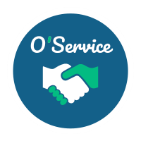

<h1 align="center">
  O'Service
</h1>
<div align="center">

</div>

<h4 align="center">Help and get help. 🤝 <br><br>
With O'Service you can post announcements and help people in your city. 
<br> Project made in O'clock school with 4 others students.
</h4>

</br>

<p align="center"> 
    <a href="https://www.w3.org/html/" target="_blank" rel="noopener noreferrer"> 
         
    </a>
    <a href="https://sass-lang.com" target="_blank" rel="noopener noreferrer"> 
        
    </a>
     <a href="https://parceljs.org/" target="_blank" rel="noopener noreferrer">
        
    </a>
     <a href="https://parceljs.org/" target="_blank" rel="noopener noreferrer">
        
    </a>
    <a href="https://developer.mozilla.org/en-US/docs/Web/JavaScript" target="_blank" rel="noopener noreferrer">
        
    </a>
    <a href="https://parceljs.org/" target="_blank" rel="noopener noreferrer">
        
    </a>
</p> 

</br>

<p align="center">
  <a href="https://oservice.netlify.app" target="_blank" rel="noopener noreferrer">Online version</a> •
  <a href="#main-features">Main Features</a> •
  <a href="#run-the-app">Run the app</a>
</p>

<br>

<p align="center">
 
</p>

<br>

## Main Features

* Registration
* Post, update, delete my announcements
* Sort announcements by categories & cities
* Reply to announcements
* Update my profile
* See others profile

<br>

## Run the app

```bash

# Clone this repository
$ git clone https://github.com/JulieCardinale/oservice-front.git

# Go into the repository
$ cd oservice-front

# Install dependencies
$ yarn

# Run the app
$ yarn start

```
